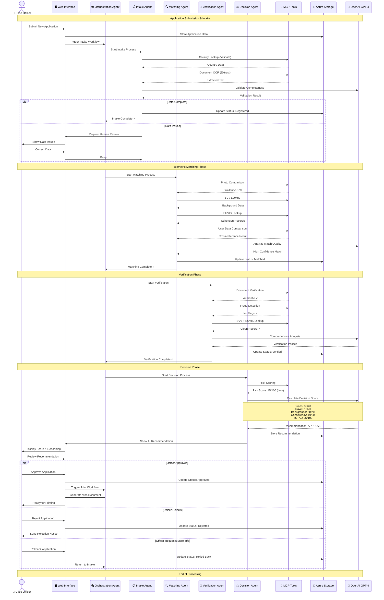
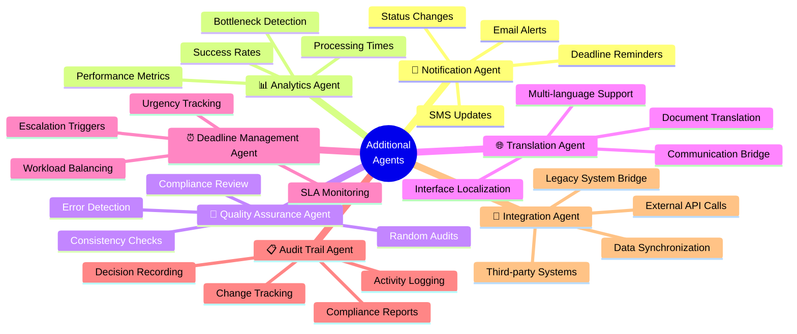

# VisaCheck System Architecture - Mermaid Diagrams

## Table of Contents
1. [Complete Application Workflow](#complete-application-workflow)
2. [AI Agent Architecture](#ai-agent-architecture)
3. [MCP Tools Integration](#mcp-tools-integration)
4. [Agent Interaction Flow](#agent-interaction-flow)

---

## Complete Application Workflow

This diagram shows the complete visa application lifecycle with all workflow stages, AI agents, and human touchpoints.

```mermaid
graph TB
    Start([New Visa Application Submitted]) --> Unassigned[📝 New Application<br/>Status: Unassigned]
    
    Unassigned --> CaseAssign{Case Assignment<br/>Agent}
    CaseAssign -->|Workload<br/>Analysis| Intake
    
    Intake[📋 Intake Application<br/>Status: Intake]
    Intake --> IntakeAgent[🤖 Intake Agent]
    IntakeAgent -->|Data Validation<br/>Country Lookup<br/>Completeness Check| IntakeComplete{Intake<br/>Complete?}
    IntakeComplete -->|Yes| Registered
    IntakeComplete -->|Issues Found| IntakeHuman[👤 Human Review<br/>Data Correction]
    IntakeHuman --> Intake
    
    Registered[✅ Application Registered<br/>Status: Registered]
    Registered -->|Document<br/>Classification| ReadyMatch
    
    ReadyMatch[🔍 Ready for Matching<br/>Status: Ready for Match]
    ReadyMatch --> MatchAgent[🤖 Matching Agent]
    
    MatchAgent -->|Photo Comparison<br/>BVV Lookup<br/>EUVIS Lookup<br/>User Data Comparison| MatchProcess{Match<br/>Quality?}
    
    MatchProcess -->|High Match<br/>>85%| Verification
    MatchProcess -->|Medium Match<br/>60-85%| MatchHuman[👤 Human Verification<br/>Manual Matching]
    MatchProcess -->|Low Match<br/><60%| MatchHuman
    MatchHuman --> Verification
    
    Verification[🔬 To be Checked<br/>Status: Verification]
    Verification --> VerifyAgent[🤖 Verification Agent]
    
    VerifyAgent -->|Document Analysis<br/>BVV Lookup<br/>EUVIS Lookup<br/>Country Lookup<br/>Fraud Detection| VerifyResult{Verification<br/>Result?}
    
    VerifyResult -->|Pass| Decision
    VerifyResult -->|Suspicious| VerifyHuman[👤 Manual Verification<br/>Detailed Review]
    VerifyResult -->|Fail| RolledBack
    VerifyHuman -->|Cleared| Decision
    VerifyHuman -->|Issues Found| RolledBack
    
    Decision[⚖️ To Decide<br/>Status: To Decide]
    Decision --> DecisionAgent[🤖 Decision Agent]
    
    DecisionAgent -->|Funds Score 40pts<br/>Travel Proof 20pts<br/>Background 20pts<br/>Consistency 20pts| DecisionScore{Total<br/>Score?}
    
    DecisionScore -->|≥85 pts<br/>Recommend<br/>APPROVE| DecisionHuman1[👤 Officer Decision<br/>Final Approval]
    DecisionScore -->|60-84 pts<br/>Manual<br/>Review| DecisionHuman2[👤 Officer Decision<br/>Detailed Review]
    DecisionScore -->|<60 pts<br/>Recommend<br/>REJECT| DecisionHuman3[👤 Officer Decision<br/>Rejection Review]
    
    DecisionHuman1 -->|Approve| Print
    DecisionHuman1 -->|Reject| Rejected
    DecisionHuman2 -->|Approve| Print
    DecisionHuman2 -->|Reject| Rejected
    DecisionHuman2 -->|More Info| RolledBack
    DecisionHuman3 -->|Approve| Print
    DecisionHuman3 -->|Reject| Rejected
    
    Print[🖨️ To Print<br/>Status: To Print]
    Print -->|Generate<br/>Documents| PrintAgent[🤖 Document<br/>Generation Agent]
    PrintAgent --> PrintHuman[👤 Print & Dispatch<br/>Physical Visa]
    PrintHuman --> Completed
    
    Completed[🎉 Completed<br/>Status: Closed]
    Completed --> Archive[(📦 Archive)]
    
    RolledBack[🔄 Rolled Back<br/>Status: Rework]
    RolledBack -->|Corrections<br/>Made| Intake
    
    Rejected[❌ Rejected<br/>Status: Declined]
    Rejected --> NotifyApplicant[📧 Rejection Notice<br/>Sent to Applicant]
    NotifyApplicant --> Archive
    
    style Unassigned fill:#9E9E9E,stroke:#757575,stroke-width:2px
    style Intake fill:#2196F3,stroke:#1976D2,stroke-width:2px
    style Registered fill:#4CAF50,stroke:#388E3C,stroke-width:2px
    style ReadyMatch fill:#FF9800,stroke:#F57C00,stroke-width:2px
    style Verification fill:#9C27B0,stroke:#7B1FA2,stroke-width:2px
    style Decision fill:#FF5722,stroke:#E64A19,stroke-width:2px
    style Print fill:#00BCD4,stroke:#0097A7,stroke-width:2px
    style Completed fill:#4CAF50,stroke:#388E3C,stroke-width:2px
    style RolledBack fill:#FF9800,stroke:#F57C00,stroke-width:2px
    style Rejected fill:#F44336,stroke:#D32F2F,stroke-width:2px
    
    style IntakeAgent fill:#E3F2FD,stroke:#2196F3,stroke-width:3px
    style MatchAgent fill:#E3F2FD,stroke:#2196F3,stroke-width:3px
    style VerifyAgent fill:#E3F2FD,stroke:#2196F3,stroke-width:3px
    style DecisionAgent fill:#E3F2FD,stroke:#2196F3,stroke-width:3px
    style PrintAgent fill:#E3F2FD,stroke:#2196F3,stroke-width:3px
    style CaseAssign fill:#E3F2FD,stroke:#2196F3,stroke-width:3px
```

---

## AI Agent Architecture

This diagram shows the AI agent ecosystem and how they interact with each other and the MCP tools.

```mermaid
graph TB
    subgraph Human_Interface["👤 Human Interface Layer"]
        Officer[Case Officer<br/>Web Interface]
        Supervisor[Supervisor<br/>Dashboard]
    end
    
    subgraph Orchestration_Layer["🎯 Orchestration Layer"]
        Orchestrator[🎭 Orchestration Agent<br/>Workflow Coordinator]
        ChatAgent[💬 Chat Agent<br/>Sexy Visa Agent<br/>User-Facing Interface]
        CaseAgent[📊 Case Assignment Agent<br/>Workload Distribution]
    end
    
    subgraph Specialist_Agents["🤖 Specialist AI Agents"]
        IntakeAgent[📋 Intake Agent<br/>Data Validation]
        MatchingAgent[🔍 Matching Agent<br/>Biometric & Database Match]
        VerificationAgent[🔬 Verification Agent<br/>Document & Fraud Analysis]
        DecisionAgent[⚖️ Decision Agent<br/>Recommendation System]
        DocumentAgent[📄 Document Generation Agent<br/>Visa Printing]
    end
    
    subgraph MCP_Tools["🔧 MCP Tools Layer"]
        PhotoComp[📸 Photo Comparison Tool<br/>Facial Recognition]
        BVV[🔐 BVV Lookup Tool<br/>Background Verification]
        EUVIS[🇪🇺 EUVIS Lookup Tool<br/>Schengen Database]
        UserData[👤 User Data Comparison<br/>Cross-Reference]
        CountryLookup[🌍 Country & Number Lookup<br/>Validation Service]
        DocumentOCR[📄 Document OCR Tool<br/>Text Extraction]
        FraudDetect[🚨 Fraud Detection Tool<br/>Pattern Analysis]
        RiskScore[📊 Risk Scoring Tool<br/>ML-based Assessment]
    end
    
    subgraph Data_Layer["💾 Data & Storage Layer"]
        AzureDB[(Azure Table Storage<br/>Application Data)]
        FileStore[(File Storage<br/>Documents & Photos)]
        OpenAI[OpenAI GPT-4<br/>AI Reasoning Engine]
        Cache[(Redis Cache<br/>Session Data)]
    end
    
    %% Human to Orchestration
    Officer --> ChatAgent
    Officer --> CaseAgent
    Supervisor --> Orchestrator
    
    %% Orchestration to Specialists
    Orchestrator -->|Trigger| IntakeAgent
    Orchestrator -->|Trigger| MatchingAgent
    Orchestrator -->|Trigger| VerificationAgent
    Orchestrator -->|Trigger| DecisionAgent
    Orchestrator -->|Trigger| DocumentAgent
    
    ChatAgent -->|Route Request| Orchestrator
    CaseAgent -->|Assign| IntakeAgent
    
    %% Specialists to MCP Tools
    IntakeAgent -->|Use| CountryLookup
    IntakeAgent -->|Use| DocumentOCR
    
    MatchingAgent -->|Use| PhotoComp
    MatchingAgent -->|Use| BVV
    MatchingAgent -->|Use| EUVIS
    MatchingAgent -->|Use| UserData
    
    VerificationAgent -->|Use| BVV
    VerificationAgent -->|Use| EUVIS
    VerificationAgent -->|Use| CountryLookup
    VerificationAgent -->|Use| DocumentOCR
    VerificationAgent -->|Use| FraudDetect
    
    DecisionAgent -->|Use| RiskScore
    DecisionAgent -->|Use| BVV
    
    DocumentAgent -->|Generate| FileStore
    
    %% MCP Tools to Data
    PhotoComp --> FileStore
    BVV --> AzureDB
    EUVIS --> AzureDB
    UserData --> AzureDB
    CountryLookup --> Cache
    DocumentOCR --> FileStore
    FraudDetect --> OpenAI
    RiskScore --> OpenAI
    
    %% All agents use OpenAI
    IntakeAgent --> OpenAI
    MatchingAgent --> OpenAI
    VerificationAgent --> OpenAI
    DecisionAgent --> OpenAI
    Orchestrator --> OpenAI
    ChatAgent --> OpenAI
    
    %% All agents use Azure DB
    IntakeAgent --> AzureDB
    MatchingAgent --> AzureDB
    VerificationAgent --> AzureDB
    DecisionAgent --> AzureDB
    
    style Human_Interface fill:#E8F5E9,stroke:#4CAF50,stroke-width:3px
    style Orchestration_Layer fill:#FFF3E0,stroke:#FF9800,stroke-width:3px
    style Specialist_Agents fill:#E3F2FD,stroke:#2196F3,stroke-width:3px
    style MCP_Tools fill:#F3E5F5,stroke:#9C27B0,stroke-width:3px
    style Data_Layer fill:#FFEBEE,stroke:#F44336,stroke-width:3px
```

---

## MCP Tools Integration

Detailed view of MCP (Model Context Protocol) tools and their capabilities.

```mermaid
graph LR
    subgraph MCP_Tool_Ecosystem["🔧 MCP Tool Ecosystem"]
        
        subgraph Biometric_Tools["👁️ Biometric & Identity"]
            Photo[📸 Photo Comparison<br/>━━━━━━━━━━━<br/>• Facial Recognition<br/>• Similarity Score<br/>• Age Detection<br/>• Quality Check]
            UserComp[👤 User Data Comparison<br/>━━━━━━━━━━━<br/>• Name Matching<br/>• DOB Verification<br/>• Address Validation<br/>• Document Cross-ref]
        end
        
        subgraph Database_Tools["🗄️ Database Lookup"]
            BVV[🔐 BVV Lookup<br/>━━━━━━━━━━━<br/>• Background Checks<br/>• Criminal Records<br/>• Visa History<br/>• Watchlist Status]
            EUVIS[🇪🇺 EUVIS Lookup<br/>━━━━━━━━━━━<br/>• Schengen Database<br/>• Previous Visas<br/>• Entry/Exit Records<br/>• Overstay Detection]
            Country[🌍 Country Lookup<br/>━━━━━━━━━━━<br/>• Country Codes<br/>• Phone Formats<br/>• Document Types<br/>• Visa Requirements]
        end
        
        subgraph Document_Tools["📄 Document Processing"]
            OCR[📄 Document OCR<br/>━━━━━━━━━━━<br/>• Text Extraction<br/>• Field Recognition<br/>• Multi-language<br/>• Format Detection]
            DocVerify[✅ Document Verification<br/>━━━━━━━━━━━<br/>• Authenticity Check<br/>• Watermark Detection<br/>• Template Matching<br/>• Security Features]
        end
        
        subgraph Analysis_Tools["🧠 Analysis & AI"]
            Fraud[🚨 Fraud Detection<br/>━━━━━━━━━━━<br/>• Pattern Analysis<br/>• Anomaly Detection<br/>• Risk Indicators<br/>• ML Models]
            Risk[📊 Risk Scoring<br/>━━━━━━━━━━━<br/>• Multi-factor Score<br/>• Historical Data<br/>• Predictive Analytics<br/>• Decision Support]
            Consistency[🔄 Consistency Check<br/>━━━━━━━━━━━<br/>• Data Validation<br/>• Cross-document<br/>• Timeline Analysis<br/>• Logic Verification]
        end
    end
    
    subgraph Agent_Usage["🤖 Agent Usage Matrix"]
        direction TB
        
        Usage["Agent → MCP Tool Usage:<br/><br/>
        📋 Intake Agent:<br/>
        • Country Lookup ✓<br/>
        • Document OCR ✓<br/>
        • Consistency Check ✓<br/><br/>
        
        🔍 Matching Agent:<br/>
        • Photo Comparison ✓<br/>
        • BVV Lookup ✓<br/>
        • EUVIS Lookup ✓<br/>
        • User Data Comparison ✓<br/><br/>
        
        🔬 Verification Agent:<br/>
        • BVV Lookup ✓<br/>
        • EUVIS Lookup ✓<br/>
        • Document OCR ✓<br/>
        • Document Verification ✓<br/>
        • Fraud Detection ✓<br/>
        • Country Lookup ✓<br/>
        • Consistency Check ✓<br/><br/>
        
        ⚖️ Decision Agent:<br/>
        • Risk Scoring ✓<br/>
        • BVV Lookup ✓<br/>
        • Fraud Detection ✓<br/>
        • Consistency Check ✓"]
    end
    
    Photo --> Usage
    BVV --> Usage
    EUVIS --> Usage
    UserComp --> Usage
    Country --> Usage
    OCR --> Usage
    DocVerify --> Usage
    Fraud --> Usage
    Risk --> Usage
    Consistency --> Usage
    
    style Biometric_Tools fill:#E1F5FE,stroke:#0277BD,stroke-width:2px
    style Database_Tools fill:#F3E5F5,stroke:#6A1B9A,stroke-width:2px
    style Document_Tools fill:#E8F5E9,stroke:#2E7D32,stroke-width:2px
    style Analysis_Tools fill:#FFF3E0,stroke:#E65100,stroke-width:2px
    style Agent_Usage fill:#FCE4EC,stroke:#C2185B,stroke-width:2px
```

---

## Agent Interaction Flow

This sequence diagram shows how agents interact during a typical application processing workflow.

---

## Additional Agent Recommendations

Based on the workflow analysis, here are additional agents that could enhance the system:

### 🆕 Suggested Additional Agents

---

## System Statistics & Metrics

### Current Implementation Status

| Component | Status | Description |
|-----------|--------|-------------|
| 📝 Intake Agent | ✅ Implemented | Data validation, country lookup |
| 🔍 Matching Agent | ✅ Implemented | Biometric matching, EUVIS lookup |
| 🔬 Verification Agent | ✅ Implemented | Document analysis, fraud detection |
| ⚖️ Decision Agent | ✅ Implemented | 4-criteria scoring (100 points) |
| 🎭 Orchestration Agent | ✅ Implemented | Workflow coordination |
| 💬 Chat Agent | ✅ Implemented | User interface (Sexy Visa Agent) |
| 📊 Case Assignment Agent | ✅ Implemented | Workload distribution |
| 📄 Document Generation | ⏳ Planned | Visa printing automation |
| 📧 Notification Agent | ⏳ Planned | Automated alerts |
| 🔧 MCP Tools | ⏳ Partial | Framework ready, tools in development |

### Workflow Stages

| Stage | Icon | Color | AI Agent | Human Action |
|-------|------|-------|----------|--------------|
| New Application | 📝 | Gray | Case Assignment | Assign officer |
| Intake | 📋 | Blue | Intake Agent | Data entry |
| Registered | ✅ | Green | - | Review |
| Ready for Match | 🔍 | Orange | Matching Agent | Initiate |
| Verification | 🔬 | Purple | Verification Agent | Review results |
| Decision | ⚖️ | Deep Orange | Decision Agent | Final decision |
| To Print | 🖨️ | Cyan | Document Agent | Print & dispatch |
| Completed | 🎉 | Green | - | Archive |
| Rolled Back | 🔄 | Orange | - | Corrections |
| Rejected | ❌ | Red | - | Send notice |

---

## Legend

### Symbols Used

- 🤖 = AI Agent (Automated)
- 👤 = Human Officer (Manual)
- 🎭 = Orchestration/Coordination
- 🔧 = MCP Tool/Service
- 💾 = Data Storage
- 🧠 = AI Reasoning Engine
- 📊 = Analytics/Metrics
- ✅ = Completed/Approved
- ❌ = Rejected/Failed
- ⏳ = Pending/In Progress
- 🔴 = Urgent/High Priority

### Color Coding

| Color | Meaning | Used For |
|-------|---------|----------|
| Gray | Neutral/Waiting | Unassigned applications |
| Blue | Active Processing | Intake, MCP tools |
| Green | Success/Complete | Registered, Approved, Completed |
| Orange | Attention Needed | Ready for Match, Rolled Back |
| Purple | Analysis | Verification stage |
| Deep Orange | Critical Decision | Decision stage |
| Cyan | Final Processing | Printing stage |
| Red | Rejected/Error | Declined applications |

---

## Integration Notes

### MCP Tool Requirements

All MCP tools should implement the Model Context Protocol standard with:

1. **Standardized Interface**: Consistent request/response format
2. **Error Handling**: Graceful degradation and retry logic
3. **Logging**: Comprehensive activity tracking
4. **Authentication**: Secure API access
5. **Rate Limiting**: Prevent abuse and ensure availability
6. **Caching**: Improve performance for repeated queries
7. **Versioning**: Support for tool updates without breaking changes

### Agent Communication Protocol

Agents communicate through:

1. **Session State**: Streamlit session management
2. **Azure Queue**: Asynchronous task processing
3. **Event System**: Trigger-based workflow progression
4. **OpenAI Function Calling**: Structured agent responses
5. **Database Events**: Status change notifications

---

**Document Version**: 1.0  
**Last Updated**: October 27, 2025  
**Author**: VisaCheck Development Team  
**Status**: ✅ Complete and Validated